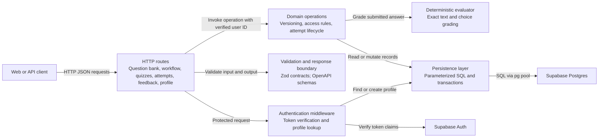

# API components

**Scope:** The Express API container. This view groups responsibilities and request flow rather than mirroring source folders.

Routes are thin request adapters. Database modules currently contain the domain checks and transactional operations. Auth middleware verifies tokens before protected handlers and creates a profile when needed. Question batch ingestion validates and retains one versioned artifact; a separate transaction materializes its private drafts and key mappings. Question bank reads project the default published version; separate owner-management reads expose candidates. Explicit publication operations update the pointer and append audit events in one transaction. Human review operations create assigned work items, fence decisions with leased claim tokens, and publish only after the final gate approves. Quiz membership checks require exact-version publication history. Read and write queries enforce ownership, visibility, and lifecycle rules; RLS is enabled without direct Data API policies. The evaluator reads frozen attempt snapshots, not a question's latest version. Zod also validates JSONB values when they cross back into application code.

The API's OpenAPI document is generated from API schemas at build time. See [API conventions](../../../../backend/docs/api-conventions.md) for endpoint contract details.
