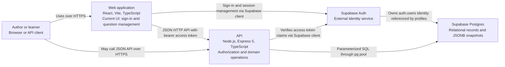

# Container view

**Scope:** Quiz Builder runtime and external services. A container here is a major runtime boundary, not necessarily a Docker container.

The web application uses TanStack Router and Query. Only question management calls are wired into its UI today. The API exposes question bank, quiz, attempt, feedback, profile, and health routes. `shared/` is a build-time contracts package used by both applications, not a runtime container. SQL migrations define the schema; generated database types describe rows; shared Zod schemas validate domain and API payloads.

The local Vite server proxies `/api` to the API during development. Production hosting and network topology are not specified in this repository, so no deployment view is asserted.

The [API component view](components/api.md) expands the API boundary.
