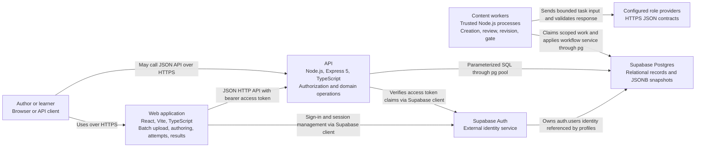

# Container view

**Scope:** Quiz Builder runtime and external services. A container here is a major runtime boundary, not necessarily a Docker container.

The web application uses TanStack Router and Query. Question and quiz management, JSON batch upload and materialization, agent creation requests, workflow status, human review, attempts, results, history, and feedback submission are wired into its UI. The API exposes question bank, batch and workflow, quiz, attempt, feedback, profile, and health routes. Batch artifacts can be prepared outside the runtime and uploaded by an authenticated author; ingestion and draft creation are separate API operations. Each agent role runs in a separate trusted backend worker process with no public machine API. The backend process submitting a version chooses the role policy; the worker and human routes use the same workflow transition service for decisions and publication. `shared/` is a build-time contracts package used by both applications, not a runtime container. SQL migrations define the schema; generated database types describe rows; shared Zod schemas validate domain and API payloads.

The local Vite server proxies `/api` to the API during development. Production hosting and network topology are not specified in this repository, so no deployment view is asserted.

The [API component view](components/api.md) expands the API boundary.
