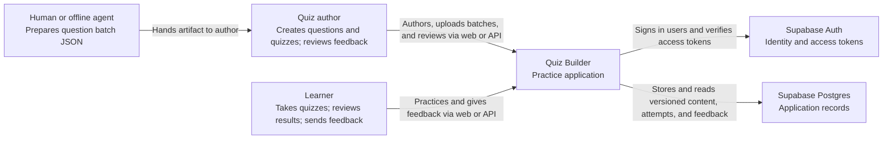

# System context

**Scope:** Quiz Builder as one software system. Relationships show who uses it and which external services it depends on.

The backend API provides question batch ingestion, quiz management, attempt, and feedback operations. An author can upload a batch made manually or by an offline agent, then materialize private drafts and submit them for review. The web UI provides these actions as well as sign-in, authoring, quiz taking, results, history, and feedback submission. Reviewing received feedback is currently API-only. Supabase Auth owns credentials and sessions. The application uses `auth.users.id` directly for profile and ownership IDs.
