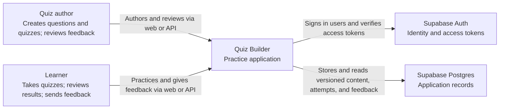

# System context

**Scope:** Quiz Builder as one software system. Relationships show who uses it and which external services it depends on.

The backend API already provides quiz management, attempt, and feedback operations. The current web UI provides sign-in and question management; the remaining user journeys are API-only for now. Supabase Auth owns credentials and sessions. The application uses `auth.users.id` directly for profile and ownership IDs.
