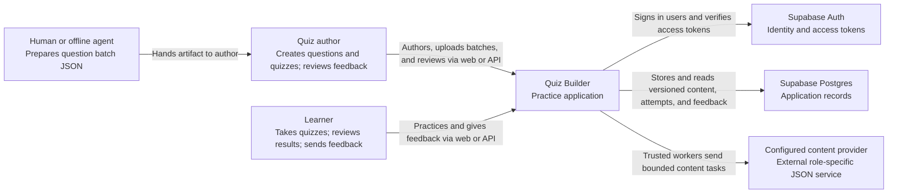

# System context

**Scope:** Quiz Builder as one software system. Relationships show who uses it and which external services it depends on.

The backend API provides explicit question publication, review/work queue, question batch ingestion, quiz management, attempt, and feedback operations. An author can upload a batch made manually or by an offline agent, then materialize private drafts and submit them for review. Configured providers can create or act on content only through trusted workers; they have no application credentials. The web UI provides sign-in, authoring, batch upload, human review and publication actions, quiz taking, results, history, and feedback submission. Reviewing received feedback is currently API-only. Supabase Auth owns credentials and sessions. The application uses `auth.users.id` directly for profile and ownership IDs.
