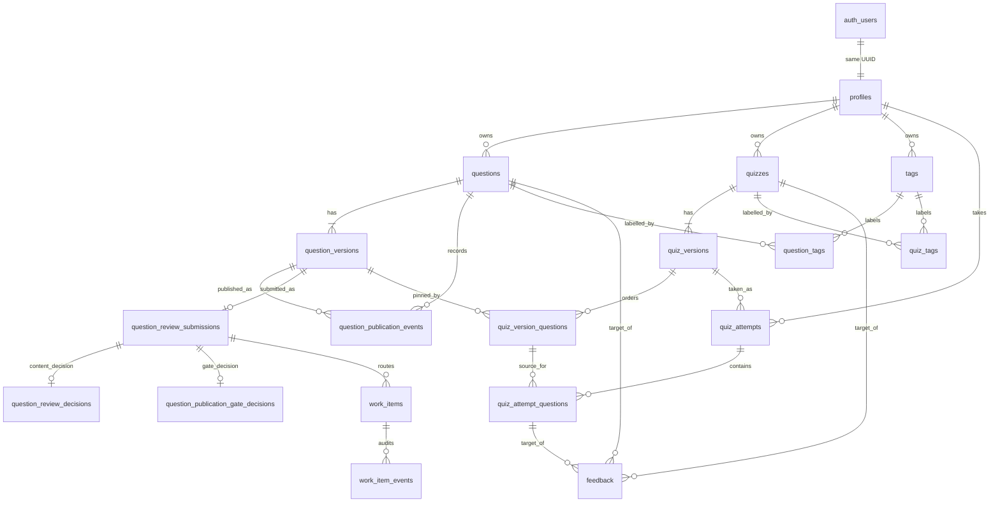

# Data model

**Scope:** Architecturally important persisted relationships. The [initial SQL migration](../../../supabase/migrations/20260928174208_initial_schema.sql), [publication migration](../../../supabase/migrations/20260930120000_question_publication.sql), and [workflow migration](../../../supabase/migrations/20260930160000_human_review_workflow.sql) are authoritative for exact columns, constraints, indexes, and triggers.

`questions` and `quizzes` keep stable ownership, visibility, status, and a pointer to their current version. Questions also have a nullable `default_published_version_id`, which the bank uses for its summary. Composite foreign keys ensure each pointer belongs to the same question. Append-only `question_publication_events` record direct approval, publication, unpublication, archive, and restore actions; publication events establish which exact versions have ever been published. A published question must have a default pointer. Draft questions have none; archived questions may retain one. `quiz_version_questions` pins a specific question version and its order, points, and attempt settings. Composite keys also ensure a pinned version belongs to the stated question. Version and membership rows cannot be updated or deleted because of database triggers.

The bank lists only published question identities and projects their default published version. A separate owner-management read exposes candidates. New quiz memberships require an accessible question that is currently published and an exact version with publication history. An existing quiz version retains its pinned reference if the source question is later unpublished or archived.

A review submission binds one question version to a server-chosen policy snapshot. Immutable review and gate decisions record distinct approvals. Work items hold typed inputs, assignment, status, lease generation, and claim token; append-only events record routing changes. Gate approval writes publication evidence and the default pointer in one transaction. New candidate versions cancel older open work items.

An attempt references one quiz version. Starting it copies quiz settings and each presented question's content, answer, grading configuration, and points into snapshot columns. Database triggers prevent snapshot changes and reject membership that does not match the quiz version. Responses, evaluation results, and score summaries are JSONB; shared Zod schemas validate their shapes in application code. A database check requires feedback to reference exactly one target. User-scoped tag slugs are unique per owner.

All application tables have RLS enabled but no direct Data API policies. The API uses its database connection and enforces access in queries. See [ADR-002](../decisions/ADR-002-api-authorization-boundary.md) for the authorization boundary.
