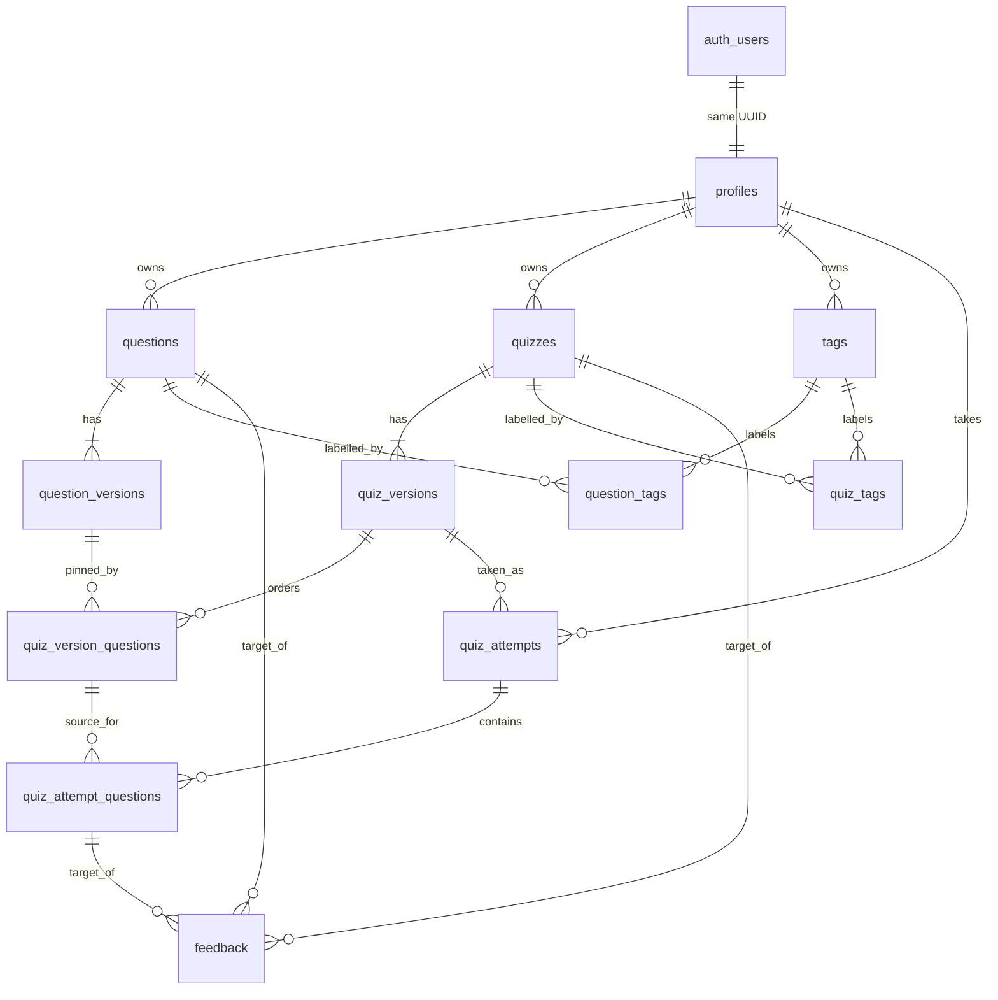

# Data model

**Scope:** Architecturally important persisted relationships. The [SQL migration](../../../supabase/migrations/20260928174208_initial_schema.sql) is authoritative for exact columns, constraints, indexes, and triggers.

`questions` and `quizzes` keep stable ownership, visibility, status, and a pointer to their current version. Composite foreign keys ensure each current version belongs to that identity. `quiz_version_questions` pins a specific question version and its order, points, and attempt settings. Composite keys also ensure a pinned version belongs to the stated question. Version and membership rows cannot be updated or deleted because of database triggers.

An attempt references one quiz version. Starting it copies quiz settings and each presented question's content, answer, grading configuration, and points into snapshot columns. Database triggers prevent snapshot changes and reject membership that does not match the quiz version. Responses, evaluation results, and score summaries are JSONB; shared Zod schemas validate their shapes in application code. A database check requires feedback to reference exactly one target. User-scoped tag slugs are unique per owner.

All application tables have RLS enabled but no direct Data API policies. The API uses its database connection and enforces access in queries. See [ADR-002](../decisions/ADR-002-api-authorization-boundary.md) for the authorization boundary.
