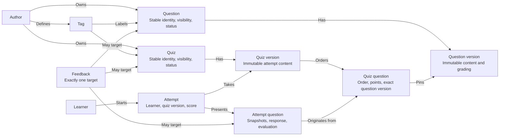

# Domain model

**Scope:** Business concepts, independent of tables and field lists.

Each feedback item targets exactly one of the three shown concepts. A quiz's visibility controls whether it can be attempted; source question visibility controls question-bank access and does not change an existing quiz version. Tags and visibility/status belong to stable identities, so editing them does not create a content version. Question and quiz versions are immutable. Attempts retain their quiz version and frozen settings, question, answer, and grading snapshots. Points may be fractional.

Supported question types are exact text, single choice, and multiple choice. Grading is currently deterministic. Correct answers are practice content, not a secret assessment boundary; review presentation is controlled by quiz settings.
