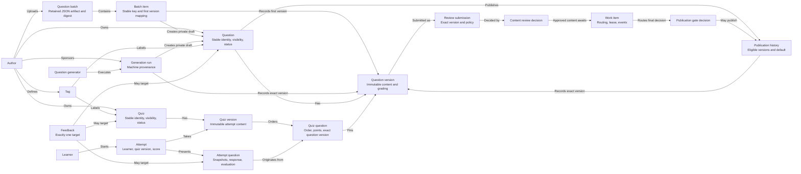

# Domain model

**Scope:** Business concepts, independent of tables and field lists.

Each batch artifact declares a human or external agent source, but its authenticated uploader is the sponsor. Materialization creates all private drafts and immutable key-to-first-version mappings in one transaction. Each imported draft requires an explicit review submission before publication; the declaration alone does not establish trusted worker provenance. Each feedback item targets exactly one of the three shown concepts. A quiz's visibility controls whether it can be attempted; source question visibility controls question-bank access and does not change an existing quiz version. A question can keep an unpublished current candidate while its earlier published default remains in the bank. Any previously published version of an accessible, currently published question can be newly selected for a quiz; a draft version cannot. A submitted candidate has an immutable policy snapshot and distinct content-review and publication-gate decisions. Work items route those decisions and track leases; their status is not a question status. Tags and visibility/status belong to stable identities, so editing them does not create a content version. Question and quiz versions are immutable. Attempts retain their quiz version and frozen settings, question, answer, and grading snapshots. Points may be fractional.

Supported question types are exact text, single choice, and multiple choice. Grading is currently deterministic. Correct answers are practice content, not a secret assessment boundary; review presentation is controlled by quiz settings.
