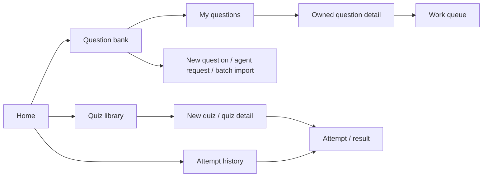

# Screen inventory and navigation

Source: the [frontend router](../../../frontend/src/app/router.tsx), [application layout](../../../frontend/src/app/layout.tsx), and page components. All routes below except `/` and `/sign-in` render inside `RequireAuth`. The backend can read eligible public or unlisted questions and quizzes anonymously, but the current frontend requires sign-in to reach those pages ([QB-08](../../use-cases.md), [LIB-11](../../use-cases.md)).

| Route | Screen and audience | Primary action | Next screen or result |
| --- | --- | --- | --- |
| `/` | Home; anyone | Read app introduction and API status | Primary navigation or sign-in |
| `/sign-in` | Sign-in/sign-up; signed-out users | Authenticate or create an account | `/questions` after a session is returned |
| `/questions` | Published question bank; signed-in author or learner | Browse/filter published questions, create a tag | Published question detail; new question, generation, import, or my questions |
| `/questions/mine` | Owned drafts and questions; signed-in author | Find a managed question | Owned question detail; bank or creation paths |
| `/questions/new` | Manual question editor; signed-in author | Save a private-by-default draft and first version | `/questions/mine/$questionId` |
| `/questions/agent` | Agent request; signed-in sponsor | Submit a generation brief | `/work-items` |
| `/questions/batches` | Batch import and retained batches; signed-in sponsor | Preview/retain JSON, materialize drafts, submit versions for review | Owned question detail or work queue |
| `/questions/$questionId` | Published question detail; signed-in viewer | Read the default published version and publication history summary | Bank or owned detail when owner |
| `/questions/mine/$questionId` | Owned question detail; owner | Revise, tag, change visibility, publish directly when eligible, or submit for review | Work queue, my questions, or same detail after action |
| `/quizzes` | Quiz library; signed-in author or learner | Browse/filter available quizzes | Quiz detail or new quiz |
| `/quizzes/new` | New quiz editor; signed-in author | Select published question versions and save a quiz | `/quizzes/$quizId` |
| `/quizzes/$quizId` | Quiz detail; signed-in viewer, with owner controls | Start an attempt; owner may edit content, tags, visibility, and lifecycle | Attempt, quiz list, or same detail after action |
| `/attempts` | Attempt history; signed-in learner | Resume or review an attempt | Attempt detail or quiz detail |
| `/attempts/$attemptId` | In-progress attempt or completed result; attempt owner | Submit answers and complete; review result and send feedback | History or quiz detail |
| `/work-items` | Content work queue; signed-in user | Claim and decide assigned human review/gate work, or handle available work items | Owned question detail or updated queue |

Unknown routes render a not-found page with a return-home link.

## Navigation as implemented

The header offers **Home → Questions → Quizzes → Attempts**, plus **Work queue** for a signed-in user and a sign-in/sign-out action. The Questions link opens the published bank; a link inside that page opens My questions. Manual creation, agent generation, and batch import are reached from question-bank links. Quiz creation begins from the quiz list. Practice begins on a quiz detail page; Attempts opens history. The work queue is top-level only after sign-in.

## Review prompts

- Can an author find the difference between published questions and owned drafts from the current labels and links?
- Is the question-production path understandable across manual creation, agent request, batch import, review, and publication?
- Can a learner find a quiz and resume a previous attempt without using the authoring pages?
- Which screens should be reachable while signed out, given the existing public read APIs?
